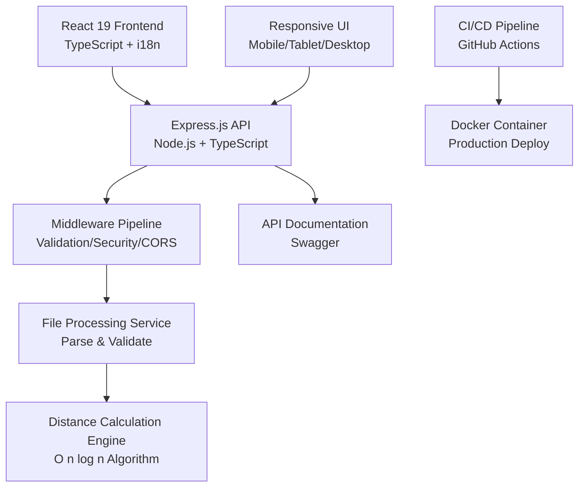
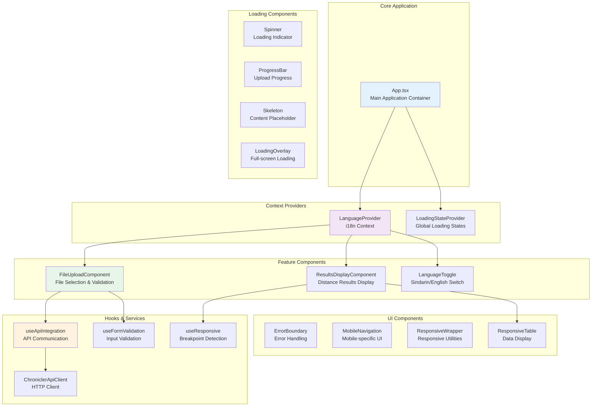
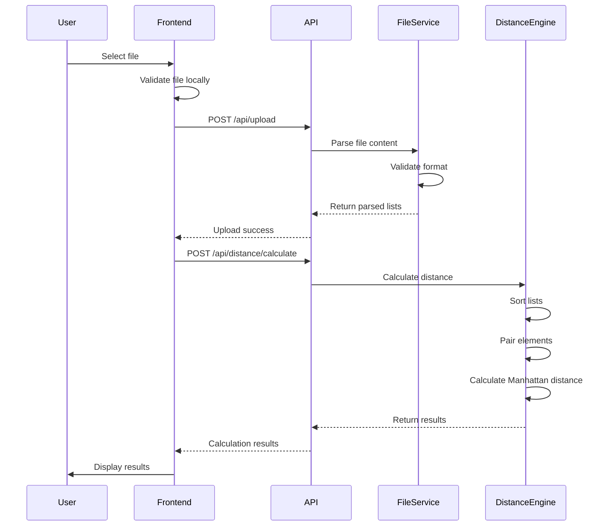
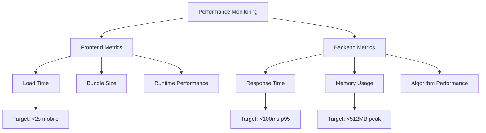
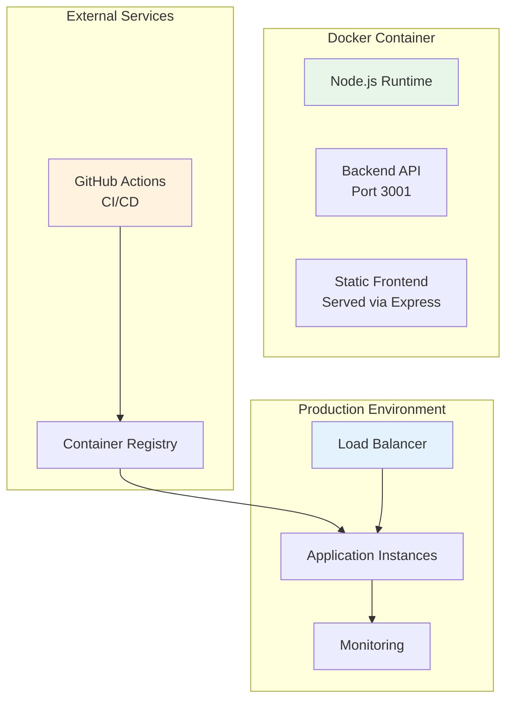

# Chronicler Architecture Documentation

> **📊 Viewing Diagrams**: This document contains Mermaid diagrams. If they appear as text, try viewing on GitHub, GitLab, or use a Mermaid-compatible viewer like [Mermaid Live Editor](https://mermaid.live/).

## Table of Contents
1. [System Overview](#system-overview)
2. [Component Architecture](#component-architecture)
3. [Backend Architecture](#backend-architecture)
4. [Data Flow](#data-flow)
5. [Technology Stack](#technology-stack)
6. [Performance Architecture](#performance-architecture)
7. [Security Architecture](#security-architecture)
8. [Deployment Architecture](#deployment-architecture)
9. [Scalability Considerations](#scalability-considerations)

## System Overview

Chronicler is a web application designed to calculate Manhattan distances between two lists of numbers, built with a unique cultural twist - it serves the Elvish community first with Sindarin as the primary language.



## Component Architecture

### Frontend Structure

The frontend follows a modular, component-based architecture with clear separation of concerns:



### Component Responsibilities

#### Core Components
- **App.tsx**: Main application orchestrator, manages workflow state
- **FileUploadComponent**: Handles file selection, validation, and upload
- **ResultsDisplayComponent**: Displays calculation results with export options
- **LanguageToggle**: Manages language switching with Tengwar script support

#### Context Providers
- **LanguageProvider**: Manages i18n state and Tengwar preferences
- **LoadingStateProvider**: Centralized loading state management

#### Utility Components
- **ErrorBoundary**: Catches and displays errors gracefully
- **ResponsiveWrapper**: Provides responsive design utilities
- **MobileNavigation**: Mobile-specific navigation interface

## Backend Architecture

### Service Layer Design

```mermaid
graph LR
    subgraph "API Routes"
        R1[POST /api/upload
File Upload]
        R2[POST /api/distance/calculate
Distance Calculation]
        R3[GET /api/health
Health Check]
        R4[/api/docs
Swagger UI]
    end
    
    subgraph "Controllers"
        C1[uploadController
File Handling]
        C2[distanceController
Calculation Endpoint]
    end
    
    subgraph "Middleware"
        M1[multer
File Upload]
        M2[validationMiddleware
Input Validation]
        M3[fileValidation
File Format Check]
        M4[helmet
Security Headers]
        M5[rate-limit
Request Limiting]
    end
    
    subgraph "Services"
        S1[FileUploadService
File Processing]
        S2[DistanceCalculationEngine
Core Algorithm]
        S3[BackendValidator
Data Validation]
        S4[OptimizedDistanceCalculator
Performance Optimized]
    end
    
    R1 --> C1
    R2 --> C2
    
    C1 --> M1
    C1 --> M3
    C1 --> S1
    
    C2 --> M2
    C2 --> S2
    
    S1 --> S3
    S2 --> S4
    
    style R1 fill:#e8f5e9
    style S2 fill:#f3e5f5
    style M4 fill:#ffebee
```

### Core Services

#### DistanceCalculationEngine
- **Algorithm**: O(n log n) time complexity, O(n) space
- **Process**: Sort → Pair → Calculate → Sum
- **Memory Tracking**: Real-time memory usage monitoring
- **Performance Metrics**: Processing time measurement

#### FileUploadService
- **Validation**: Format checking, size limits
- **Parsing**: Two-column numeric data extraction
- **Error Handling**: Detailed error messages

#### OptimizedDistanceCalculator
- **Batch Processing**: Handles large datasets efficiently
- **Memory Management**: Streaming for very large files
- **Performance Profiling**: Built-in performance metrics

## Data Flow

### File Upload and Calculation Flow



### Data Structures

#### Input Format
```typescript
interface UploadedFile {
  filename: string;
  content: string;
  size: number;
}

interface ParsedData {
  list1: number[];
  list2: number[];
  metadata: {
    lineCount: number;
    parseErrors: string[];
  };
}
```

#### Calculation Result
```typescript
interface DistanceCalculationResult {
  totalDistance: number;
  pairs: Array<{
    position: number;
    list1Value: number;
    list2Value: number;
    distance: number;
  }>;
  metadata: {
    originalList1Length: number;
    originalList2Length: number;
    processingTimeMs: number;
    memoryUsedMB?: number;
    algorithmComplexity?: string;
  };
}
```

## Technology Stack

### Frontend Technologies
| Technology | Version | Purpose | Rationale |
|------------|---------|---------|-----------|
| React | 19.0.0 | UI Framework | Latest features, concurrent rendering |
| TypeScript | 5.x | Type Safety | Catch errors at compile time |
| react-i18next | 16.x | Internationalization | Sindarin/English support |
| CSS Modules | - | Styling | Component-scoped styles |
| Jest | 29.x | Testing | Comprehensive test coverage |
| React Testing Library | 16.x | Component Testing | User-centric testing |

### Backend Technologies
| Technology | Version | Purpose | Rationale |
|------------|---------|---------|-----------|
| Node.js | 20.x | Runtime | Performance, ecosystem |
| Express | 4.x | Web Framework | Simplicity, middleware ecosystem |
| TypeScript | 5.x | Type Safety | Shared types with frontend |
| Multer | 1.4.x | File Upload | Robust file handling |
| Helmet | 8.x | Security | Security headers |
| Swagger | 5.x | API Documentation | Interactive API docs |

### Infrastructure & Tools
| Technology | Purpose | Rationale |
|------------|---------|-----------|
| npm Workspaces | Monorepo Management | Shared dependencies |
| GitHub Actions | CI/CD | Native GitHub integration |
| Docker | Containerization | Consistent deployments |
| ESLint | Code Quality | Enforce standards |
| Prettier | Code Formatting | Consistent style |

## Performance Architecture

### Optimization Strategies

#### Frontend Performance
1. **Code Splitting**: Dynamic imports for large components
2. **Memoization**: React.memo for expensive renders
3. **Lazy Loading**: Components loaded on demand
4. **Bundle Optimization**: Tree shaking, minification

#### Backend Performance
1. **Algorithm Optimization**: O(n log n) sorting algorithm
2. **Memory Management**: Streaming for large files
3. **Caching**: Result caching for repeated calculations
4. **Connection Pooling**: Efficient resource usage

### Performance Benchmarks
- Small datasets (100 items): <10ms
- Medium datasets (1,000 items): <50ms
- Large datasets (10,000 items): <500ms
- Very large datasets (100,000 items): <5s

### Monitoring & Profiling


## Security Architecture

### Security Measures

#### Input Validation
- File size limits (10MB max)
- Content type validation
- Numeric data validation
- SQL injection prevention

#### API Security
- Rate limiting (100 requests/15min)
- CORS configuration
- Helmet.js security headers
- Input sanitization

#### Error Handling
- No sensitive data in errors
- Graceful error messages
- Logging without PII

### Security Headers
```javascript
// Implemented via Helmet.js
- Content-Security-Policy
- X-DNS-Prefetch-Control
- X-Frame-Options
- X-Content-Type-Options
- Strict-Transport-Security
- X-XSS-Protection
```

## Deployment Architecture

### Container Architecture


### Environment Configuration
- Development: Local development with hot reload
- Staging: Docker container with test data
- Production: Optimized build with monitoring

## Scalability Considerations

### Horizontal Scaling
- Stateless API design
- No server-side sessions
- Ready for load balancing

### Vertical Scaling
- Efficient memory usage
- Optimized algorithms
- Performance monitoring

### Future Enhancements
1. **Database Integration**: For result persistence
2. **WebSocket Support**: Real-time progress updates
3. **Worker Threads**: Parallel processing for large files
4. **CDN Integration**: Static asset delivery
5. **Caching Layer**: Redis for frequent calculations

### Scaling Metrics
- Request handling: 1000+ concurrent users
- File processing: 100MB+ files with streaming
- Response time: <100ms p95 at scale

---

*This architecture is designed to honor both technical excellence and the cultural heritage of its primary users - the Elvish community, while maintaining accessibility for all users including our Hobbit friends.*