# Chronicler Development & Deployment Pipeline

> **📊 Viewing Diagrams**: This document contains Mermaid diagrams. If they appear as text, try viewing on GitHub, GitLab, or use a Mermaid-compatible viewer like [Mermaid Live Editor](https://mermaid.live/).

## Table of Contents
1. [Development Workflow](#development-workflow)
2. [Local Development Setup](#local-development-setup)
3. [Testing Pipeline](#testing-pipeline)
4. [CI/CD Pipeline](#cicd-pipeline)
5. [Quality Gates](#quality-gates)
6. [Release Process](#release-process)
7. [Deployment Strategy](#deployment-strategy)
8. [Monitoring & Observability](#monitoring--observability)
9. [Rollback Procedures](#rollback-procedures)
10. [Performance Benchmarking](#performance-benchmarking)

## Development Workflow

### Overview

The Chronicler project follows a systematic development workflow designed for quality and efficiency:

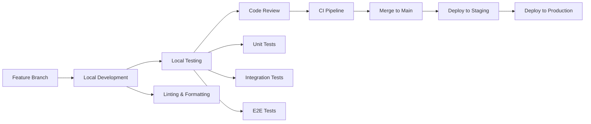

### Branch Strategy

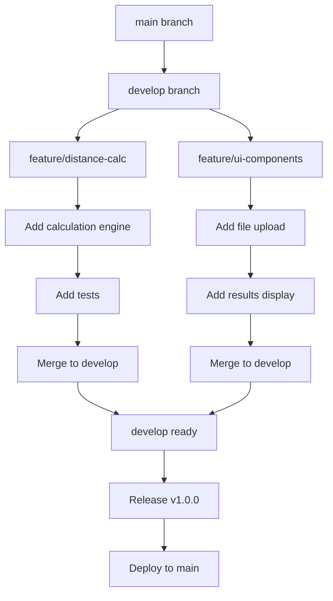

- **main**: Production-ready code
- **develop**: Integration branch
- **feature/***: Feature development
- **bugfix/***: Bug fixes
- **hotfix/***: Emergency fixes

## Local Development Setup

### Prerequisites

```bash
# Required versions
node >= 20.0.0
npm >= 10.0.0
git >= 2.30.0

# Optional but recommended
docker >= 24.0.0
```

### Initial Setup

```bash
# 1. Clone the repository
git clone https://github.com/your-org/chronicler-app.git
cd chronicler-app

# 2. Install dependencies
npm install

# 3. Set up environment variables
cp .env.example .env
# Edit .env with your configuration

# 4. Verify setup
npm run verify:setup
```

### Development Commands

```bash
# Start development servers
npm start                    # Starts both frontend and backend
npm run frontend:start       # Frontend only (port 3000)
npm run backend:dev          # Backend only (port 3001)

# Code quality
npm run lint                 # Run ESLint
npm run typecheck           # TypeScript type checking
npm run format              # Prettier formatting
npm run lint:fix            # Fix linting issues

# Testing
npm test                    # Run all tests
npm run test:watch          # Watch mode
npm run test:coverage       # Coverage report
npm run test:e2e            # End-to-end tests

# Building
npm run build               # Build both frontend and backend
npm run frontend:build      # Frontend production build
npm run backend:build       # Backend TypeScript compilation
```

### Development Workflow Diagram

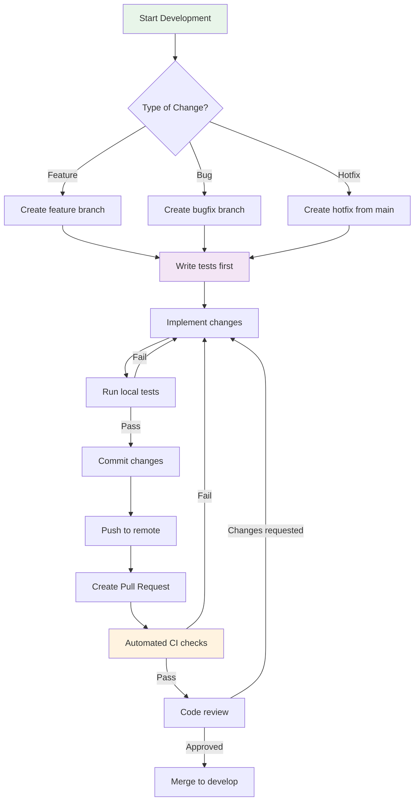

## Testing Pipeline

### Test Pyramid

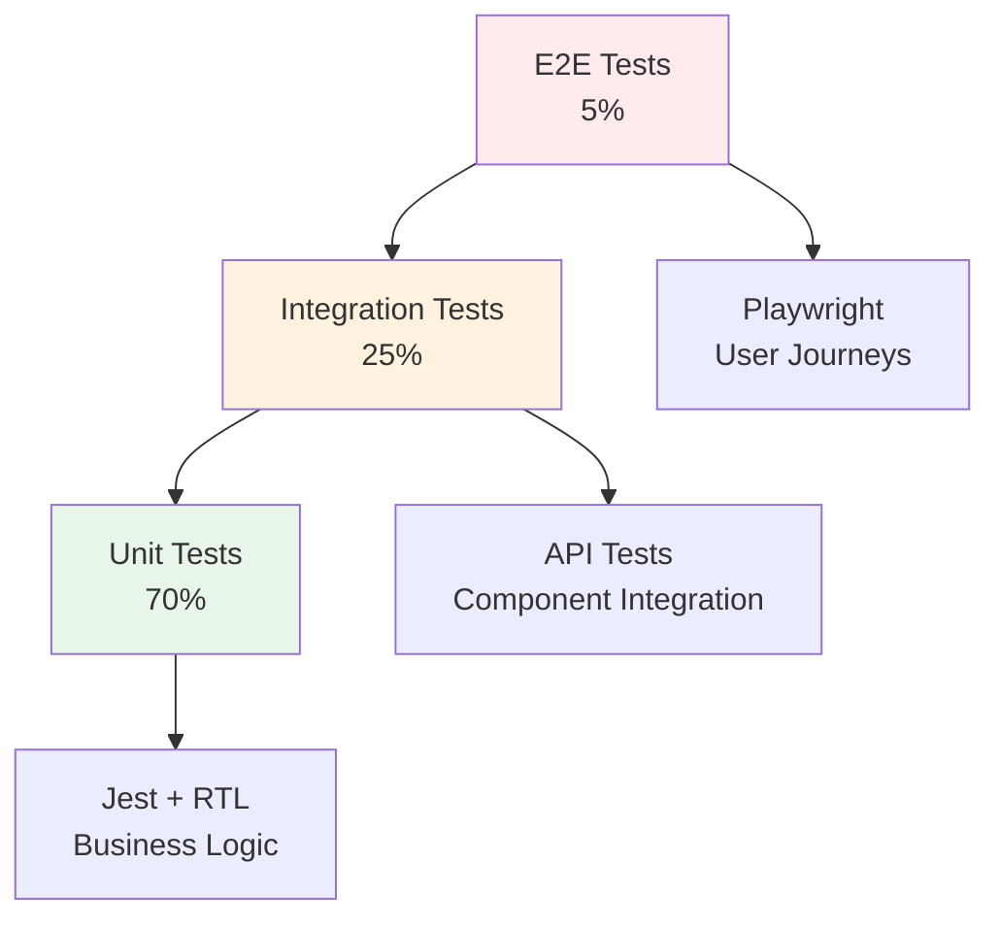

### Test Execution Flow

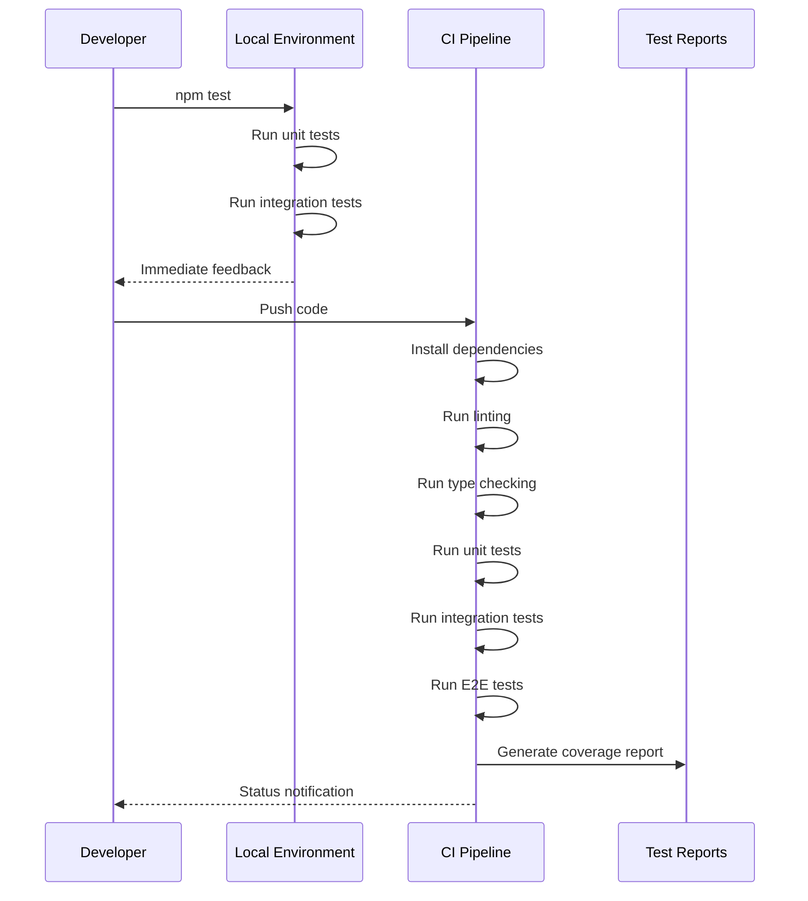

### Test Configuration

#### Unit Tests
```javascript
// jest.config.js
module.exports = {
  testEnvironment: 'jsdom',
  coverageThreshold: {
    global: {
      branches: 85,
      functions: 85,
      lines: 85,
      statements: 85
    }
  }
};
```

#### Integration Tests
- API endpoint testing
- Database integration (future)
- Service layer testing

#### E2E Tests
- Critical user journeys
- Cross-browser testing
- Mobile responsiveness

## CI/CD Pipeline

### GitHub Actions Workflow

```yaml
name: CI/CD Pipeline

on:
  push:
    branches: [main, develop]
  pull_request:
    branches: [main, develop]

jobs:
  test:
    runs-on: ubuntu-latest
    strategy:
      matrix:
        node-version: [20.x, 22.x]
```

### Pipeline Stages

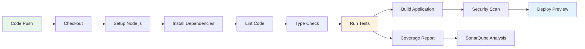

### CI Job Details

1. **Setup & Dependencies**
   - Cache node_modules
   - Install exact versions
   - Verify lockfile

2. **Quality Checks**
   - ESLint with custom rules
   - Prettier formatting
   - TypeScript strict mode

3. **Test Execution**
   - Parallel test runs
   - Coverage collection
   - Performance benchmarks

4. **Build & Package**
   - Production optimization
   - Bundle analysis
   - Docker image creation

## Quality Gates

### Automated Quality Checks

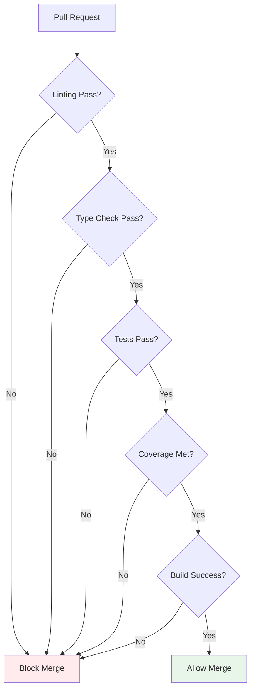

### Quality Metrics

| Metric | Threshold | Enforcement |
|--------|-----------|-------------|
| Test Coverage | >85% | Required |
| Code Duplication | <3% | Warning |
| Cyclomatic Complexity | <10 | Required |
| Bundle Size | <500KB | Warning |
| Lighthouse Score | >90 | Required |
| WCAG Compliance | AA | Required |

## Release Process

### Semantic Versioning

```
MAJOR.MINOR.PATCH

1.0.0 - Initial release
1.1.0 - Add new feature
1.1.1 - Bug fix
2.0.0 - Breaking change
```

### Release Flow

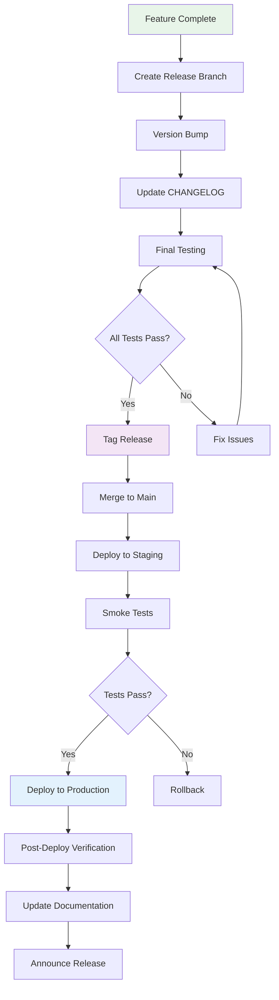

### Release Checklist

- [ ] All tests passing
- [ ] Documentation updated
- [ ] CHANGELOG.md updated
- [ ] Version bumped
- [ ] Security scan clean
- [ ] Performance benchmarks met
- [ ] Accessibility audit passed
- [ ] Release notes prepared

## Deployment Strategy

### Environment Pipeline

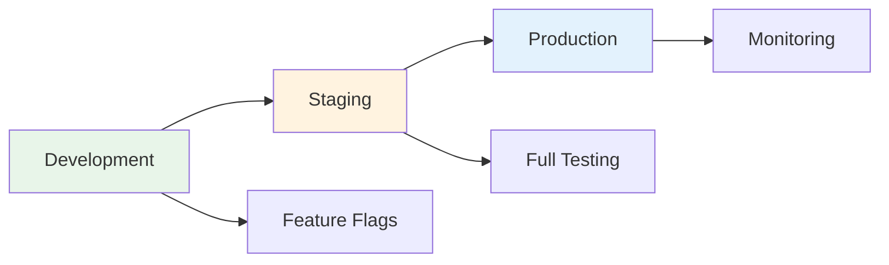

### Deployment Configuration

```yaml
# deployment.yml
environments:
  staging:
    url: https://staging.chronicler.example.com
    health_check: /api/health
    rollback_enabled: true
    
  production:
    url: https://chronicler.example.com
    health_check: /api/health
    rollback_enabled: true
    canary_percentage: 10
```

### Zero-Downtime Deployment

1. **Blue-Green Deployment**
   - Deploy to inactive environment
   - Run health checks
   - Switch traffic
   - Keep old version ready

2. **Canary Releases**
   - Deploy to small percentage
   - Monitor metrics
   - Gradually increase traffic
   - Full rollout or rollback

## Monitoring & Observability

### Metrics Collection

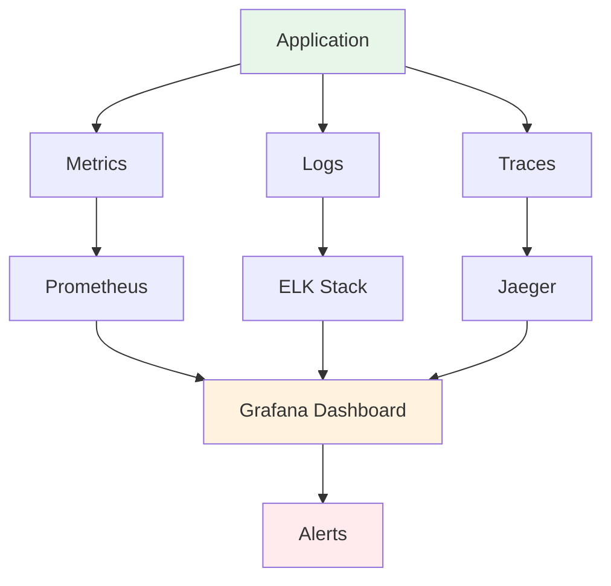

### Key Metrics

#### Application Metrics
- Request rate
- Response time (p50, p95, p99)
- Error rate
- Active users
- File upload success rate

#### Infrastructure Metrics
- CPU usage
- Memory usage
- Disk I/O
- Network latency

#### Business Metrics
- Calculations per hour
- Average file size
- User engagement
- Language preference distribution

### Alerting Rules

```yaml
alerts:
  - name: HighErrorRate
    condition: error_rate > 5%
    duration: 5m
    severity: critical
    
  - name: SlowResponse
    condition: p95_response_time > 1s
    duration: 10m
    severity: warning
    
  - name: MemoryLeak
    condition: memory_usage_trend > 10%/hour
    duration: 30m
    severity: warning
```

## Rollback Procedures

### Automated Rollback Triggers

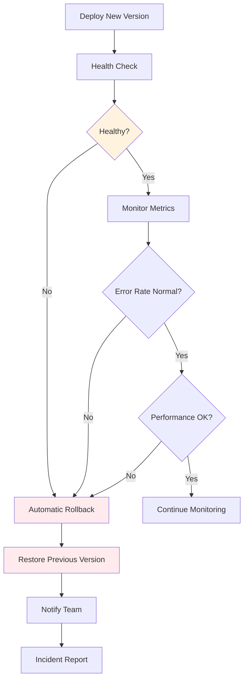

### Manual Rollback Process

```bash
# 1. Identify last known good version
git tag -l | grep prod

# 2. Create rollback branch
git checkout -b rollback/v1.2.3 prod-v1.2.2

# 3. Deploy rollback
npm run deploy:rollback -- --version=v1.2.2

# 4. Verify rollback
npm run verify:deployment

# 5. Update incident log
npm run incident:create -- --type=rollback
```

### Rollback Verification

1. **Immediate Checks**
   - Health endpoint responding
   - No 5xx errors
   - Database connectivity

2. **Functional Checks**
   - File upload working
   - Calculations accurate
   - UI rendering correctly

3. **Performance Checks**
   - Response times normal
   - Memory usage stable
   - No error spikes

## Performance Benchmarking

### Continuous Performance Testing

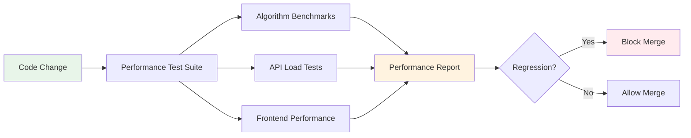

### Benchmark Targets

```javascript
// performance.config.js
module.exports = {
  targets: {
    algorithm: {
      small: { max: 10, unit: 'ms' },      // 100 items
      medium: { max: 50, unit: 'ms' },     // 1,000 items
      large: { max: 500, unit: 'ms' },     // 10,000 items
      xlarge: { max: 5000, unit: 'ms' }    // 100,000 items
    },
    api: {
      upload: { p95: 200, unit: 'ms' },
      calculate: { p95: 100, unit: 'ms' },
      health: { p95: 50, unit: 'ms' }
    },
    frontend: {
      fcp: { max: 1500, unit: 'ms' },      // First Contentful Paint
      lcp: { max: 2500, unit: 'ms' },      // Largest Contentful Paint
      tti: { max: 3500, unit: 'ms' },      // Time to Interactive
      cls: { max: 0.1 },                   // Cumulative Layout Shift
      fid: { max: 100, unit: 'ms' }        // First Input Delay
    }
  }
};
```

### Performance Monitoring Dashboard

```
┌─────────────────────────────────────────────────────┐
│                Performance Dashboard                 │
├─────────────────────────────────────────────────────┤
│ Algorithm Performance      │ API Response Times      │
│ ├─ Small: 8ms ✓           │ ├─ Upload: 185ms ✓     │
│ ├─ Medium: 42ms ✓         │ ├─ Calculate: 89ms ✓   │
│ ├─ Large: 423ms ✓         │ └─ Health: 12ms ✓      │
│ └─ XLarge: 4821ms ✓       │                         │
├────────────────────────────┴────────────────────────┤
│ Frontend Metrics           │ Bundle Size             │
│ ├─ FCP: 1.2s ✓            │ ├─ Main: 245KB ✓       │
│ ├─ LCP: 2.1s ✓            │ ├─ Vendor: 189KB ✓     │
│ ├─ TTI: 3.1s ✓            │ └─ Total: 434KB ✓      │
│ └─ CLS: 0.05 ✓            │                         │
└─────────────────────────────────────────────────────┘
```

---

*This pipeline is designed to ensure the highest quality standards while maintaining rapid development velocity. Every stage is optimized for both the scholarly precision expected by our Elvish users and the practical efficiency appreciated by our Hobbit friends.*